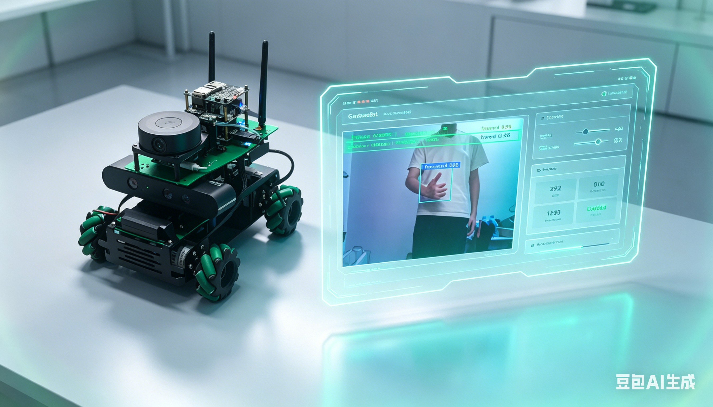
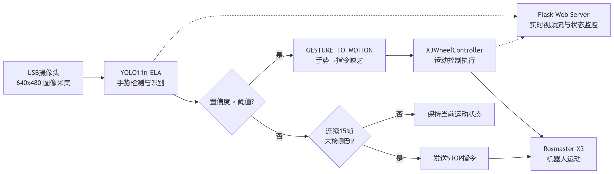
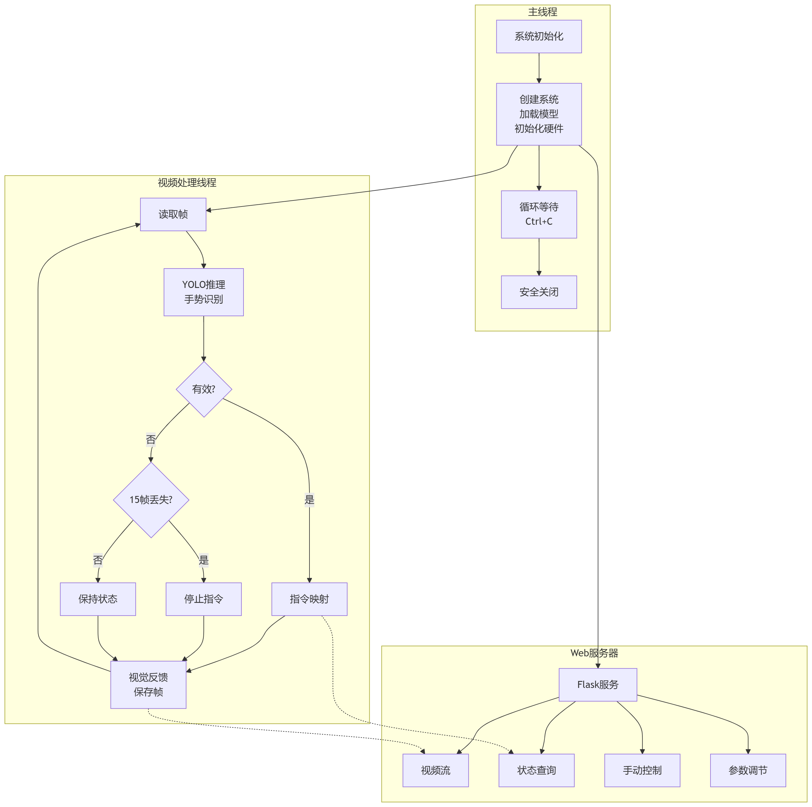
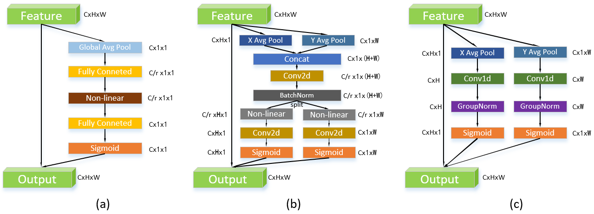
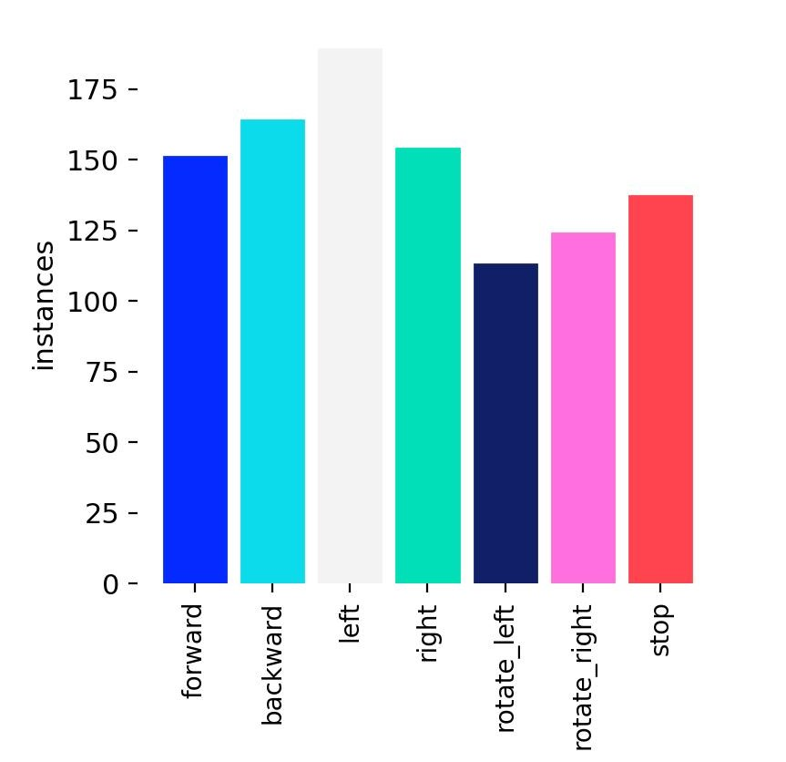
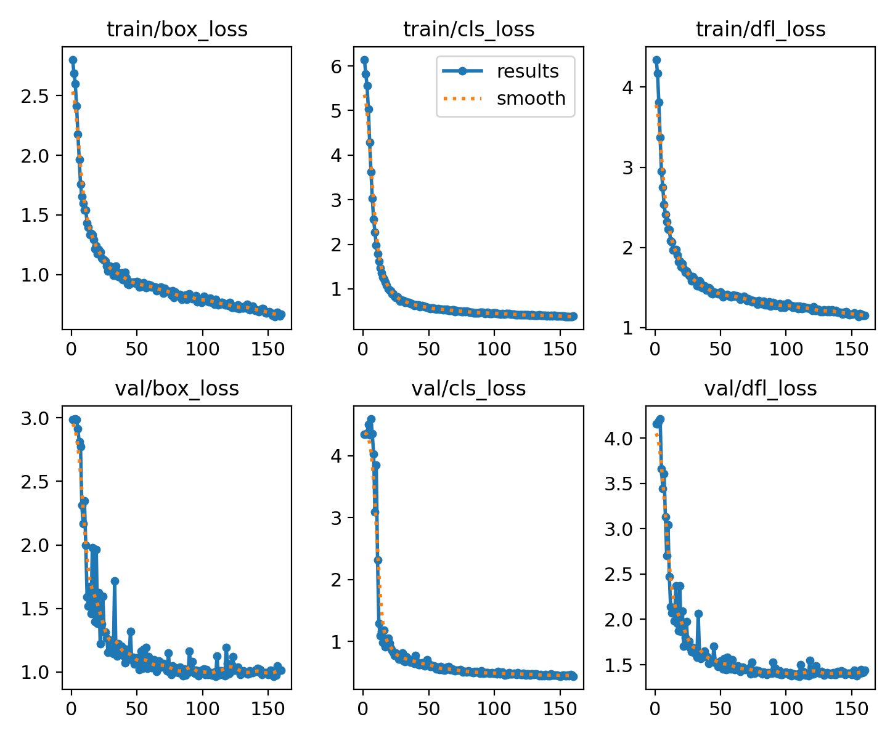
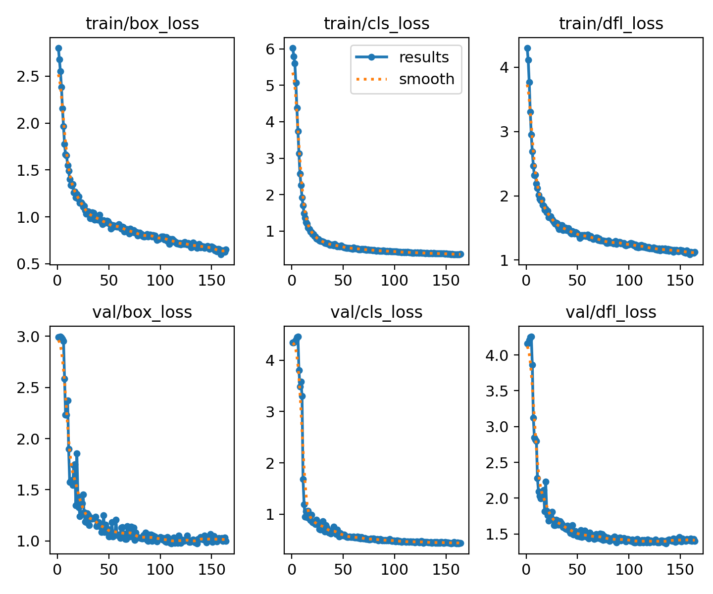
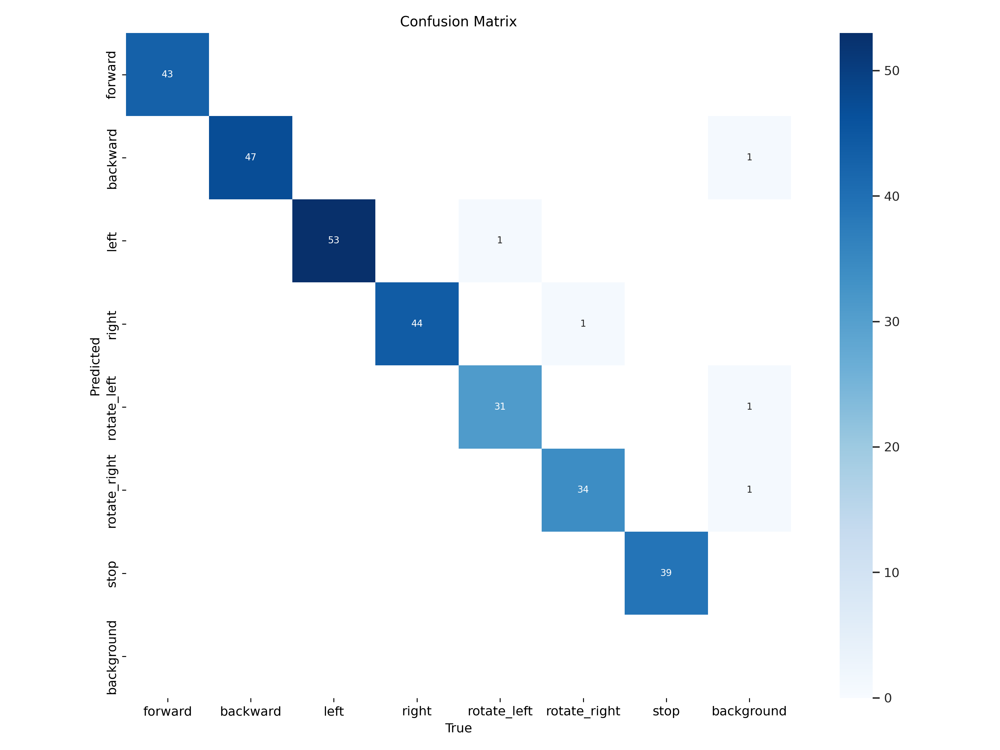
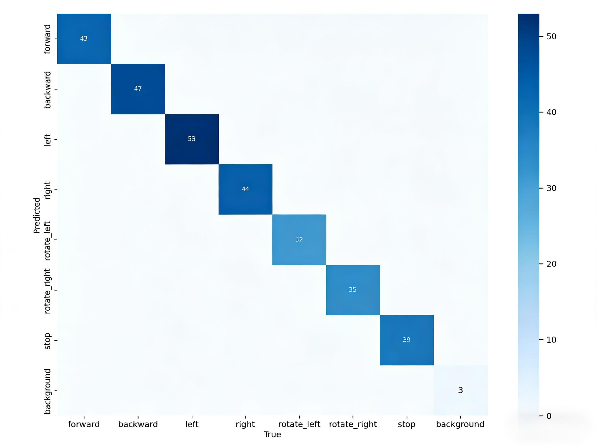

<div align="center">

# GestureBot

**基于手势识别的人车运动交互控制系统**

[]()
[]()
[]()
[]()

基于改进 YOLO11n-ELA 的实时手势识别控制系统，通过 USB 摄像头捕获手势指令，驱动 Rosmaster X3 麦克纳姆轮机器人完成 7 种全向运动控制。

<!-- </div>

<p align="center">
  
</p>

<div align="center"> -->

https://github.com/user-attachments/assets/c534d7d8-f00a-4f19-986d-0ddb50c9c714

https://github.com/user-attachments/assets/9453024d-581b-4ef9-806d-88c93aaa4147

</div>

---

## 系统总体流程

<p align="center">
  
</p>

系统通过 USB 摄像头实时采集图像，经 YOLO11n-ELA 模型推理识别 7 类手势，将手势映射为运动指令，通过串口下发至 Rosmaster X3 下位机执行运动控制，同时基于 Flask 提供 Web 可视化界面支持远程监控与手动控制。

---

## 系统架构

### 三层架构设计

<p align="center">
  
</p>

系统采用**感知层—控制层—交互层**三层架构：

| 层级 | 功能 | 核心组件 |
|------|------|----------|
| **感知层** | 图像采集与手势检测 | USB 摄像头 + YOLO11n-ELA 模型 |
| **控制层** | 指令映射与运动控制 | X3WheelController + 串口通讯 |
| **交互层** | Web 远程监控与参数调节 | Flask + Gevent HTTP 服务 |

### 多线程架构

<p align="center">
  
</p>

系统采用三线程架构：视频处理线程（推理+控制）、Web 服务线程（HTTP 请求处理）、主线程（守护与资源释放），通过 `threading.Lock` 保证线程安全。

---

## 手势控制映射

系统支持 7 种手势，每种手势直接对应一种机器人运动状态：

<div align="center">

| 手势 | forward | backward | left | right | rotate_left | rotate_right | stop |
|:----:|:-------:|:--------:|:----:|:-----:|:-----------:|:------------:|:----:|
| **指令** | 前进 | 后退 | 左移 | 右移 | 左旋转 | 右旋转 | 停止 |
| **优先级** | 普通 | 普通 | 普通 | 普通 | 普通 | 普通 | **最高** |

</div>

<p align="center">
  &nbsp;&nbsp;
  &nbsp;&nbsp;
  &nbsp;&nbsp;
  &nbsp;&nbsp;
  &nbsp;&nbsp;
  &nbsp;&nbsp;
  
</p>

> 连续 15 帧未检测到有效手势时，自动下发停止指令，确保系统安全。

---

## 模型设计与训练

### YOLO11 网络架构

<p align="center">
  
</p>

YOLO11 网络由 Backbone（C3k2 模块）、Neck（FPN+PAN 双向融合）和 Head（解耦检测头）三部分组成。本文选用最轻量的 nano 变体 YOLO11n（2.59M 参数）作为基线模型。

### ELA 注意力模块改进

在 YOLO11n 的 **Neck 特征融合层** 3 个 Concat 节点后各插入一个 ELA（Efficient Local Attention）模块，通过 1D 卷积 + GroupNorm 捕获局部空间依赖，在极小的参数增量下提升手势定位精度。

### 💬 小小疑问 (FAQ)

<details>
<summary><b>Q: 为什么选择 ELA 而不是其他注意力机制？</b></summary>
<br>
A: 相比 SE 模块（全局池化导致空间位置信息完全丢失）和 CA 模块（中间步骤需要通道降维，造成信息损失），ELA 保留了双向空间位置感知能力，且全程不压缩通道维度，在参数增量和检测精度之间取得了最优平衡。
</details>

<details>
<summary><b>Q: 为什么选择在 Neck 层的 3 个位置插入 ELA 模块？</b></summary>
<br>
A: Neck 层的 3 个 Concat 节点是 Backbone 原始特征与上层语义特征的交汇点，在此处插入 ELA 模块可以对融合后的特征进行注意力重校准（Recalibration），使模型在多尺度特征融合阶段更加关注手势目标的边缘与轮廓信息。同时，仅修改 Neck 层、保持 Backbone 不变，可以最大化兼容 YOLO11n 的预训练权重。
</details>

<p align="center">
  
</p>

<p align="center">
  
</p>

### 数据集

<p align="center">
  
</p>

GestureBot 数据集包含 7 类控制手势，共 1,549 张图像，分辨率 640×640，采用 YOLO 格式标注。

<p align="center">
  
</p>

### 训练结果

<p align="center">
  
  &nbsp;&nbsp;
  
</p>

### 模型性能对比

| 指标 | YOLO11n（基线） | YOLO11n-ELA（改进） | 变化 |
|------|:---:|:---:|:---:|
| 参数量 | 2.62M | 6.13M | +3.51M |
| Precision | 0.994 | **0.998** | +0.4% |
| Recall | 1.000 | 1.000 | 持平 |
| mAP50 | 0.995 | 0.995 | 持平 |
| mAP50-95 | 0.741 | **0.760** | +1.9% |
| 误分类数 | 5 例 | **0 例** | 完全消除 |

<p align="center">
  
  &nbsp;&nbsp;
  
</p>

---

## 硬件平台

<p align="center">
  
</p>

| **组件** | **规格** | **组件** | **规格** |
|:---:|:---|:---:|:---|
| **机器人** | Rosmaster X3 麦克纳姆轮全向移动平台 | **AI 算力** | 34 TOPS (INT8) |
| **上位机** | NVIDIA Jetson Orin Nano 4GB | **下位机** | STM32 扩展板 |
| **摄像头** | USB 摄像头 (640×480) | **深度摄像头** | 奥比中光深度摄像头 |
| **激光雷达** | YDLIDARX3 激光雷达 | **显示屏** | 7 寸屏扩展包 |
| **通讯** | USB 串口 (/dev/ttyUSB0, 115200bps) | **系统镜像** | Jetson Orin 系列 SUPER 引导（JetPack 6.2） |

---

## Web 控制界面

基于 Flask + Gevent 构建的实时监控与控制界面：

- MJPEG 实时视频流（叠加检测框、手势类别、置信度）
- 手势识别结果实时展示
- 7 种运动模式手动控制按钮
- 速度与置信度阈值在线调节
- 系统状态监控（FPS、置信度、检测次数、运动状态）
- 系统运行日志

### API 接口

| 接口 | 方法 | 说明 |
|------|------|------|
| `/` | GET | 主控制界面 |
| `/video_feed` | GET | MJPEG 实时视频流 |
| `/api/status` | GET | 系统实时状态（JSON） |
| `/api/control` | POST | 手动运动控制指令 |
| `/api/settings` | POST | 速度/置信度阈值设置 |
| `/api/logs` | GET | 运行日志查询 |
| `/api/stop` | POST | 紧急停止（最高优先级） |

---

## 快速开始

### 环境要求

- Python >= 3.9
- JetPack 6.2（Jetson 部署）
- Rosmaster X3 硬件（实际控制）

### 安装依赖

```bash
pip install -r requirements.txt
```

### 运行系统

```bash
# X3运行（使用默认参数）
python main.py

# 带自定义参数运行
python main.py model=/path/to/best.pt speed=80 port=7000 conf=0.6

# 调试模式（不实际控制小车）
python main.py debug dry_run

# 访问 Web 控制界面
# http://<Jetson_IP>:6500
```

### 数据集与训练

```bash
# 手势视频采集（空格键：开始/停止录制，q键：退出）
python dataset/tools/collect_gesture_video.py

# 视频转训练图像（自动抽帧、去重、划分训练集/验证集）
python dataset/tools/video_to_images.py

# 模型训练（Kaggle / 本地 GPU）
python kaggle/train.py --model yolo11-ELA.yaml --data kaggle/config.yaml --epochs 300 --batch 64

# 模型导出（PT → ONNX → TensorRT Engine）
python kaggle/model_pt_onnx_engine.py
```

---

## 项目结构

```
GestureBot/
├── main.py                          # 主程序入口（包含 GestureControlSystem、X3WheelController、SystemState、SimpleLogger、Flask Web 应用）
├── templates/
│   └── gesture_control.html         # Web 控制界面前端模板
├── kaggle/
│   ├── train.py                     # YOLO11n/YOLO11n-ELA 训练脚本
│   ├── config.yaml                  # 数据集路径与训练超参数
│   ├── model_pt_onnx_engine.py      # 模型导出（PT→ONNX→TensorRT）
│   └── predict.py                  # 模型离线推理测试脚本
├── dataset/
│   └── tools/                       # 数据采集、预处理工具
│       ├── collect_gesture_video.py # 手势视频采集
│       ├── video_to_images.py       # 视频转训练图像
│       ├── split_gesturebot_dataset.py # 数据集划分
│       └── image_quality_checker.py # 图像质量检查
├── training_analysis/               # 训练结果分析与可视化
├── ultralytics/                     # YOLO11 框架（含 ELA 模块）
│   ├── nn/modules/ela.py            # ELA 注意力模块实现
│   └── cfg/models/11/yolo11-ELA.yaml # YOLO11n-ELA 架构配置
├── train.py                        # 训练脚本
├── CLAUDE.md                       # 项目完整技术文档
└── README.md                       # 项目说明文档
```

---

## 技术栈

| 类别 | 技术 |
|------|------|
| 目标检测 | Ultralytics YOLO11 |
| 注意力机制 | ELA (Efficient Local Attention, CVPR 2024) |
| Web 框架 | Flask + Gevent |
| 图像处理 | OpenCV |
| 机器人控制 | Rosmaster_Lib (串口通讯) |
| 模型部署 | TensorRT (Jetson 端侧推理加速) |
| 训练平台 | Kaggle (2× Tesla T4 16G GPU) |

## 许可证

MIT License
