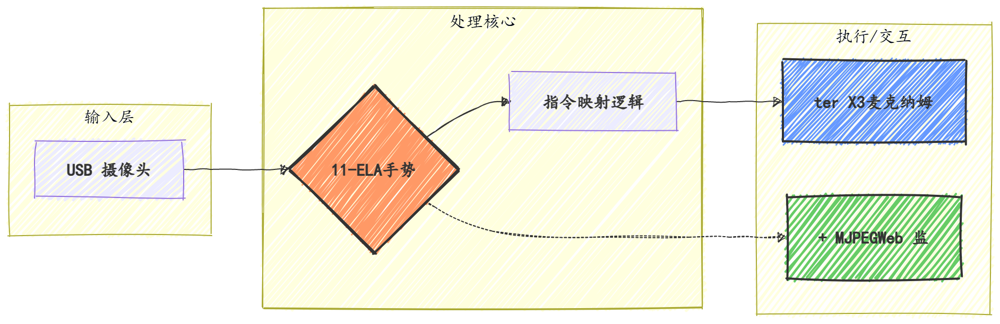
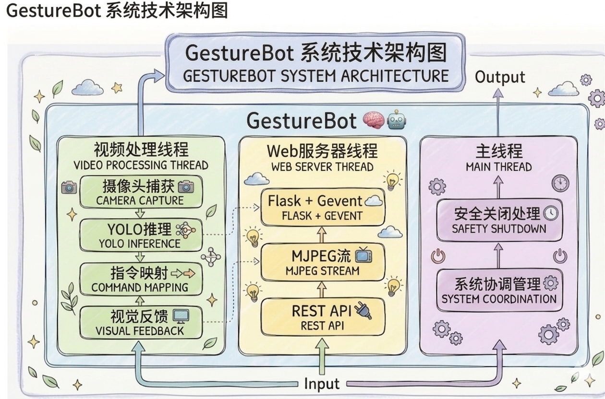
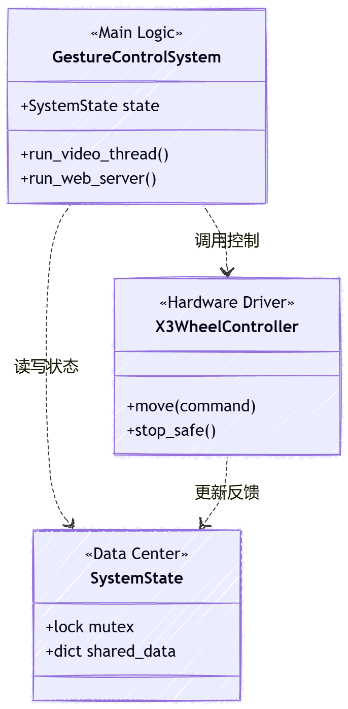
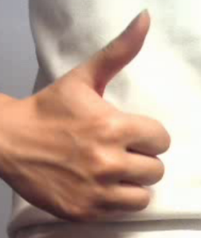
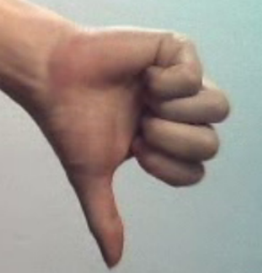
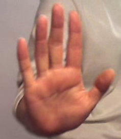
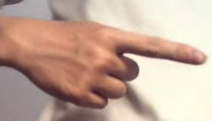
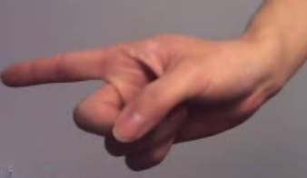
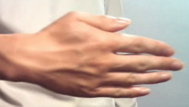
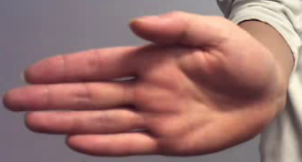

# GestureBot - 基于手势识别的人车运动交互控制系统

**Gesture-Based Human-Vehicle Interaction Control System**

基于 YOLO11 的实时手势识别控制系统，通过摄像头捕获手势指令，驱动 Rosmaster X3 机器人完成前进、后退、转向等运动控制。

<p align="center">
  
  
</p>

https://github.com/user-attachments/assets/d0ed9f7a-1411-40e4-8a6c-04cacf6c3812

## 系统概览

<p align="center">
  
</p>

**核心流程**：USB 摄像头实时捕获画面 → YOLO11 推理识别 7 种手势 → 映射为运动指令 → 驱动机器人执行动作，同时通过 Web 界面提供实时视频流和手动控制。

## 手势控制映射

系统支持 7 种手势，每种手势直接对应一种机器人运动状态：


<div align="center">
  
  
  
  
  
  
  
</div>

<table border="0">
  <tr>
    <td width="55%">
      
    </td>
    <td width="45%" valign="middle">
      <h4>指令集说明</h4>
      <p>🔵 <b>纵向:</b> <code>forward</code> | <code>backward</code></p>
      <p>🟢 <b>平移:</b> <code>left</code> | <code>right</code></p>
      <p>🟠 <b>旋转:</b> <code>rotate_l</code> | <code>rotate_r</code></p>
      <p>🔴 <b>状态:</b> <code>stop</code> (15帧失联保护)</p>
      <hr>
      <p><i>基于 YOLO11-ELA 识别推理</i></p>
    </td>
  </tr>
</table>


> 连续 15 帧未检测到有效手势时，自动执行停止指令，确保安全性。


## 🛠️ 系统架构 (System Architecture)

<p align="center">
  
</p>
<table border="0">
  <tr>
    <td width="65%" valign="top">
      <h4>🧩 核心类实现 (Core Classes)</h4>
      <ul>
        <li><code>GestureControlSystem</code> — <b>决策中心</b><br/>
          <small>驱动视频流线程，集成 YOLO11-ELA 推理引擎，下达高层运动指令。</small><br/><br/></li>  
        <li><code>X3WheelController</code> — <b>执行驱动</b><br/>
          <small>对接 Rosmaster X3 底盘，封装 7 种全向移动模式与安全刹车逻辑。</small><br/><br/></li>
        <li><code>SystemState</code> — <b>状态管理</b><br/>
          <small>维护全局变量，通过 <code>threading.Lock</code> 确保多线程读写的数据一致性。</small><br/><br/></li>
        <li><code>SimpleLogger</code> — <b>日志系统</b><br/>
          <small>轻量化内存缓冲区，支持实时追踪推理延迟与指令下发记录。</small><br/><br/></li>
      </ul>
      <blockquote style="font-size: 0.9em;">
        <b>💡 设计解耦：</b> 这种模块化结构确保了 AI 算法与硬件控制器的完全分离，仅需更换 <code>X3WheelController</code> 即可适配不同底盘。
      </blockquote>
    </td>
    <td width="35%" align="center" valign="middle">
      
      <p align="center"><small><i>类关系依赖图</i></small></p>
    </td>
  </tr>
</table>


## 模型训练

### 数据集


<table border="0">
  <tr>
    <td width="35%" valign="top">
      <h4>📑 样本分布</h4>
      <ul>
        <li><b>总计:</b> 1,549 Images</li>
        <li><b>类别:</b> 7 Gestures</li>
        <li><b>分辨率:</b> 640 × 640</li>
      </ul>
      <h4>📈 数据划分</h4>
      
      
      
      <br><br>
      <p align="left">
        <i>采用 YOLO 格式标注，涵盖了不同光照和背景下的真实室内场景。</i>
      </p>
    </td>
    <td width="65%" align="center">
      <h4>手势识别数据集样本示例（局部裁剪图）</h4>
      <table border="0">
        <tr>
          <td></td>
          <td></td>
          <td></td>
        </tr>
        <tr>
          <td></td>
          <td></td>
          <td></td>
        </tr>
        <tr>
          <td colspan="3" align="center">
            
          </td>
        </tr>
      </table>
    </td>
  </tr>
</table>


### 基线模型（YOLO11n）

| 指标 | 值 |
|------|------|
| 模型 | YOLO11n（从零训练） |
| 训练平台 | Kaggle (2× Tesla T4) |
| 训练轮次 | 175 (early stopping) |
| Precision | 0.993 |
| Recall | 1.000 |
| mAP50 | **0.995** |
| mAP50-95 | 0.733 |
| 参数量 | 2.62M |

### 模型改进：YOLO11n-ELA

在 YOLO11n 的 Neck 特征融合层中引入 **ELA（Efficient Local Attention）** 注意力机制（CVPR 2024），通过 1D 空间卷积 + GroupNorm 捕获局部空间依赖，提升边界框定位精度。

> 实验数据对比表（训练进行中，完成后补充）

## Web 控制界面

基于 Flask + Gevent 构建的实时监控与控制界面：

- 实时 MJPEG 视频流显示
- 手势识别结果实时展示（手势类别 → 运动指令 → 置信度）
- 7 种运动模式手动控制按钮
- 速度和置信度阈值滑块调节
- 系统状态监控（FPS、置信度、检测次数、模型状态）
- 手势对照表
- 运行日志


### API 接口

| 接口 | 方法 | 说明 |
|------|------|------|
| `/` | GET | 主控制界面 |
| `/video_feed` | GET | MJPEG 实时视频流 |
| `/api/status` | GET | 系统状态（JSON） |
| `/api/control` | POST | 手动运动控制 |
| `/api/settings` | POST/GET | 速度/阈值参数设置 |
| `/api/logs` | GET | 运行日志 |

## 快速开始

### 环境要求

- Python >= 3.8
- CUDA 支持（推理加速）
- Rosmaster X3 硬件（部署时）

### 安装依赖

```bash
pip install ultralytics flask gevent opencv-python Rosmaster_Lib
```

### 运行系统

```bash
# 基础运行
python main.py

# 带参数运行
python main.py model=/path/to/best.pt speed=80 port=7000 host=192.168.1.100

# 访问 Web 界面
# http://<host>:6500
```

### 数据集采集

```bash
# 采集手势视频
python dataset/tools/collect_gesture_video.py
# 空格键：开始/停止录制 | q键：退出

# 视频转训练图片
python dataset/tools/video_to_images.py
```

## 项目结构

```
GestureBot/
├── main.py                    # 主程序（手势识别控制系统）
├── predict.py                 # 模型推理测试脚本
├── templates/
│   └── gesture_control.html   # Web 控制界面
├── kaggle/
│   ├── train.py               # Kaggle 训练脚本（YOLO11n-ELA）
│   ├── config.yaml            # 训练超参数配置
│   ├── model_pt_onnx_engine.py # 模型导出（PT→ONNX→TensorRT）
│   └── 训练测试结果             # ELA 模型 3 轮验证输出
├── training_analysis/         # 基线模型训练结果与分析报告
├── ultralytics/               # YOLO11 框架（含 ELA 模块）
│   └── nn/modules/ela.py      # ELA 注意力模块实现
├── dataset/                   # 数据集工具
│   └── tools/                 # 视频采集、帧提取工具
└── CLAUDE.md                  # 项目技术文档
```

## 技术栈

| 类别 | 技术 |
|------|------|
| 目标检测 | Ultralytics YOLO11 |
| 注意力机制 | ELA (CVPR 2024) |
| Web 框架 | Flask + Gevent |
| 图像处理 | OpenCV |
| 机器人控制 | Rosmaster_Lib |
| 模型部署 | TensorRT (Jetson) |
| 训练平台 | Kaggle (2× Tesla T4) |

## 许可证

MIT License
